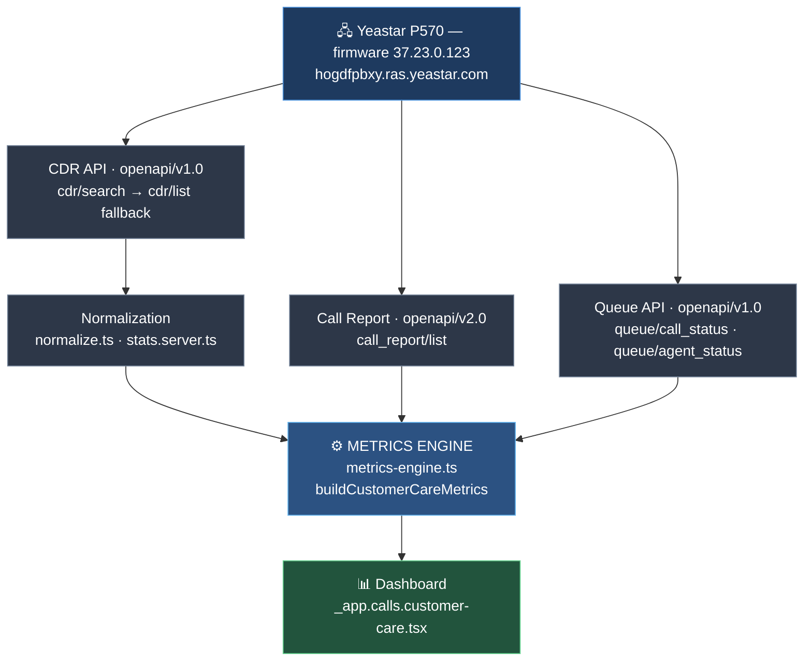

# Sprint 3 — Customer Care Analytics Architecture

Companion to `sprint2-source-validation.md`, which carries the evidence for
every source decision recorded here.

---

## 1. Data flow



### The same flow, with what each stage contributes

```
                    Yeastar P570  (firmware 37.23.0.123)
                              │
        ┌─────────────────────┼─────────────────────┐
        │                     │                     │
   Queue API             Call Report              CDR API
   openapi/v1.0          openapi/v2.0  ⚠          openapi/v1.0
   call_status           call_report/list         cdr/search
   agent_status          queueperformance         (list fallback)
        │                 queueagentperformance         │
        │                     │                         │
   present-moment        per-agent MISSED          every leg of
   state only            (CDR cannot                every call
        │                 produce it)                   │
        │                     │                         ▼
        │                     │                  Normalization
        │                     │            group by call_id · dedup new_id
        │                     │            classify legs by roster
        │                     │            outcome · exclusions · durations
        │                     │                         │
        └─────────────────────┼─────────────────────────┘
                              ▼
                    ┌──────────────────────┐
                    │    METRICS ENGINE    │
                    │ buildCustomerCare-   │
                    │      Metrics()       │
                    │                      │
                    │  every KPI derived   │
                    │  exactly once, each  │
                    │  tagged with its     │
                    │  source              │
                    └──────────┬───────────┘
                               ▼
                          Dashboard
                    renders metrics.* only
                     (formats, never derives)
```

> ⚠ **Call Report must be `openapi/v2.0`.** On v1.0 the PBX accepts
> `start_time`/`end_time`, silently ignores them and returns `errcode 0` with
> `total_number: 0`. It does not fail — it lies. See §2 of the validation report.

---

## 2. Source of truth, per metric

| Metric | Source | Why not the others |
| --- | --- | --- |
| Total / answered / answer rate | **CDR** | Exact parity with Yeastar; CDR adds per-call drill-down and arbitrary windows |
| Queue calls · queue answer rate | **CDR** | Exact parity |
| SLA attainment · within SLA | **CDR** | Exact parity, and the threshold stays re-runnable; Call Report is fixed at the queue's `sla_time` |
| Avg queue wait (all + answered) | **CDR** | Exact parity, sub-second; Call Report truncates to whole seconds |
| Max queue wait | **CDR** | Exact parity |
| Avg / total talk | **CDR** | Within 1%; the gap is our transfer handling (O5), a decision not a defect |
| Inbound / outbound split | **CDR** | Queue reports are inbound-only |
| Daily answer-rate trend | **CDR** | Same formula as the headline card, applied per day |
| **Per-agent missed calls** | **Call Report** | **CDR physically cannot supply it** — this firmware writes an agent-leg row only when the agent answers |
| Per-agent answered / talk / ring | **CDR** | Exact parity; keeps per-call drill-down |
| Waiting / active / ringing · agent states | **Queue API** | Only source of present-moment state |
| Missed vs Abandoned split | **CDR** (unchanged) | **TODO(O1)** — Yeastar's split is surfaced beside ours, never merged |

---

## 3. Caching

Every PBX call is cached, and each layer states what invalidates it.

| Layer | TTL | Key | Guards against |
| --- | --- | --- | --- |
| Token (L1 memory + L2 Postgres) | until expiry | singleton | `get_token` rate limit — `errcode 60002` locks the whole integration out |
| CDR fetch | 5 min | `from\|to` | Repeated full-window sweeps, the dominant page cost |
| Normalization | until CDR array identity changes | `from\|to\|rosterSignature` | Re-normalizing the same rows on every filter toggle |
| **Call Report** | **5 min** | **`from\|to\|queueId`** | **2 live PBX GETs per viewer per 20s poll** |
| PBX roster | 5 min | singleton | `queue/list` + paged `extension/list` per request |
| Agent roster | 5 min | singleton | 3 Supabase reads + a PBX fetch per request |

Client side, React Query holds `staleTime: 20s` with `keepPreviousData`, so a
filter change never blanks the page and a hidden tab stops polling.

The Call Report query is keyed on **window + queue only** — deliberately not on
direction or agent. The report is inbound and queue-scoped by construction, so
those filters cannot change its response; including them would re-query the PBX
for byte-identical data on every toggle.

---

## 4. Degradation

| Failure | Behaviour |
| --- | --- |
| **Call Report unavailable** | Every CDR-derived KPI renders unchanged. The per-agent Missed column shows "—", never `0`. `metrics.callReport.error` carries the reason. |
| **Queue API unavailable** | Realtime tiles read 0 with `realtime.available: false`; `sources.realtime` becomes `unavailable`. Historical KPIs untouched. |
| **CDR delayed** | `analytics: null` → a fully-zeroed metric set, `isEmpty: false` (nothing loaded ≠ a window with no calls), every source `unavailable`. Realtime tiles keep rendering — they are the operationally urgent half. |

A zero and an unknown are never allowed to look alike. That is why
`missedSource` exists per agent row, and why `isEmpty` distinguishes "no calls"
from "not loaded".

---

## 5. The rule

> **The Metrics Engine derives. The dashboard formats.**

A component may call `hhmmss()` or `pct()`, and may choose not to render a
value. It may not compute one — no `.filter()`, no `.reduce()`, no ratios, no
`?? 0` standing in for a metric. If a widget needs a number that is not on
`CustomerCareMetrics`, the number belongs on `CustomerCareMetrics`.

This is enforced by `metrics-engine.test.ts`, which fails if any metric group
lacks a `sources` entry, and by `yeastar-parity.test.ts`, which asserts the
engine's output against the PBX's own report.
